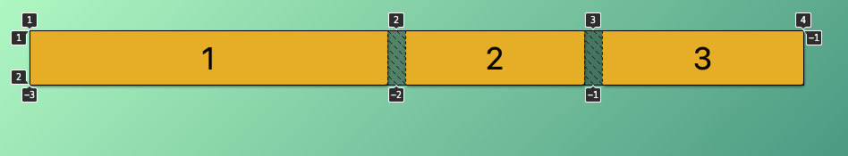

# CSS grid

## Table of Contents

- [About](#about)

- [Getting Started](#getting_started)
- [Fragment](#fragment)
- [Layout](#layout)
  - [grid-auto-flow](#grid-auto-flow)
  - [size-grid-items](#size-grid-items)

## About 

Use Css grid to create awesome layouts

 

## Getting Started 

1.Run `yarn/npm` install
2.run `yarn/npm` dev , if npm then `npm run dev` else `yarn dev`

### Prerequisites

`Node >= ^10.0`

 

## Fragment 

`Fr` is a fractional unit and 1fr is for 1 part of the available space.

## Grid-auto-flow 

Works similar like in flexbox with `flex-direction`, so if you have a left over column that will not fit on your row you could add the `grid-auto-flow:column` to stretch it and it will work similar like a `display:flex`

 

## size-grid-items 

When we want a given grid item to take some space we really don't want to give at a fixed with while it will effect all the other items in the same column, instead we can span our grid item either with `grid-column-start` and `grid-column-end` or make it shorter like `grid-column: start-unit/end-unit`.
We could also use the `span` keyword like:
`grid-column: span 2` which means: `hey item I want you to take up 2 columns from where you are right now`.

 
